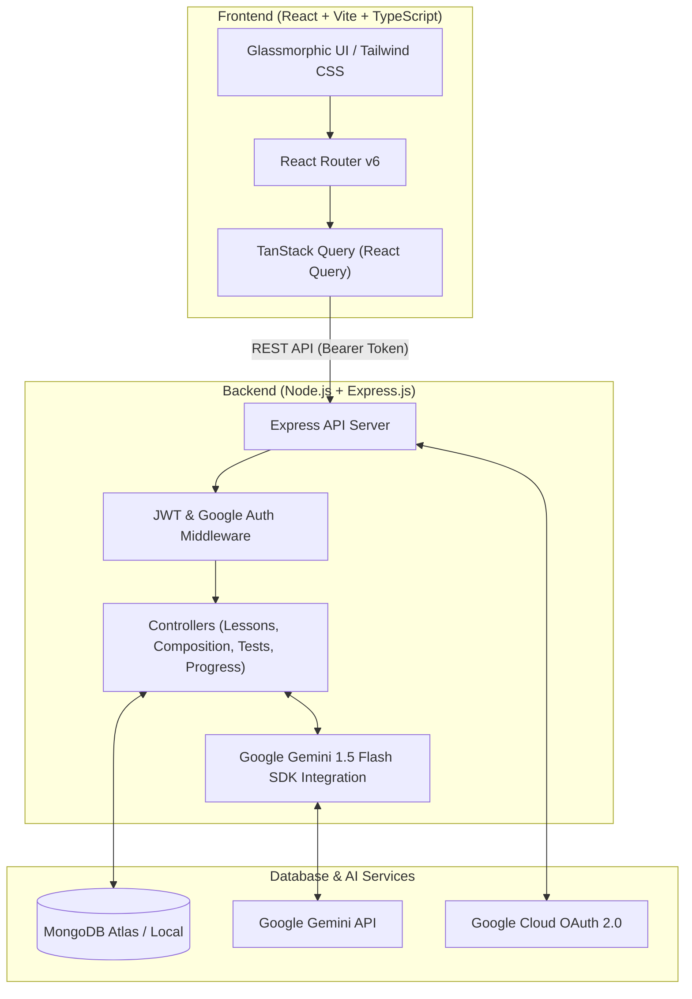

# 🎓 English AI Tutor — Next-Generation Intelligent Language Platform

[](https://react.dev/)
[](https://nodejs.org/)
[](https://www.mongodb.com/)
[](https://ai.google.dev/)
[](https://tailwindcss.com/)
[](LICENSE)

**English AI Tutor** is an end-to-end, full-stack language learning web application designed to elevate reading, writing, grammar, tone, and vocabulary skills. Powered by **Google Gemini 1.5 Flash AI**, the platform offers personalized, real-time feedback on user submissions, adaptive exercise recommendations, dynamic test generation, and gamified progress tracking.

---

## 🌟 Key Highlights & Features

### 🧠 1. AI-Powered Evaluation Engine
- **Instant Grammar & Style Audits**: Evaluates essays, formal letters, reports, tone practice, and short paragraphs.
- **Constructive & Actionable Feedback**: Provides detailed structural scores (Grammar, Vocabulary, Tone, Coherence) along with suggested vocabulary enhancements and rewrites.
- **Objective & Subjective Evaluation**: Evaluates free-text open-ended prompts as well as multiple-choice questions automatically.

### 📚 2. Comprehensive Learning Modules
- **Reading Comprehension**: Level-adaptive passages with contextual vocabulary definitions and auto-graded comprehension questions.
- **Composition & Essay Mastery**: Scaffolding for multi-paragraph essays, formal/informal letters, reports, and persuasive writing.
- **Tone & Style Practice**: Practice shifting writing registers (e.g., informal to executive academic or formal business tone).
- **Vocabulary & Sentence Formation**: Interactive exercises targeting high-frequency vocabulary and complex sentence structures.

### ⚡ 3. On-Demand Dynamic Test Generator
- **Custom AI Test Generation**: Generates real-time custom tests based on topic, skill level, and exercise type.
- **Timed Assessment Mode**: Simulates standardized test environments with immediate scoring and analytical feedback.

### 🏆 4. Gamification & Student Engagement
- **Streak Tracker**: Maintains daily active usage streaks to encourage consistent practice.
- **Global Leaderboard**: Ranks learners based on earned XP and completed learning objectives.
- **Personalized Progress Analytics**: Visualizes growth over time in grammar precision, vocabulary breadth, and total exercises solved.

### 🎨 5. Modern Glassmorphic UI & Design System
- **Dark-First Modern Aesthetic**: Built using custom glassmorphic panels, ambient gradient radial lights, and micro-interactions.
- **Adaptive Readability Typography**: Engineered with **Plus Jakarta Sans** for high-impact display headlines and **DM Sans** for optimal body copy legibility.
- **Hover-Interactive Feature Marquee**: Interactive skill pills that gracefully pause and lift on hover.

### 🔐 6. Production Security & Legal Suite
- **Secure Authentication**: JWT-based session management alongside native **Google OAuth 2.0** Single Sign-On.
- **Complete Legal Coverage**: Built-in, dedicated pages for Privacy Policy (`/privacy-policy`), Terms of Service (`/terms-of-service`), and Cookie Policy (`/cookie-policy`).

---

## 🏗️ System Architecture



---

## 🛠️ Tech Stack

| Category | Technology | Usage |
| :--- | :--- | :--- |
| **Frontend Core** | React 18, Vite, TypeScript | SPA build system & type safety |
| **Styling & UI** | Tailwind CSS, shadcn/ui, Lucide Icons | Responsive glassmorphic component library |
| **Typography** | Plus Jakarta Sans, DM Sans | High-legibility display & body fonts |
| **State & Data Fetching** | TanStack Query (@tanstack/react-query), React Hook Form | Cache management, async state, form handling |
| **Backend Framework** | Node.js, Express.js (v5) | RESTful API backend server |
| **Database & ODM** | MongoDB, Mongoose ODM | User profiles, progress, evaluation history, lesson storage |
| **Artificial Intelligence** | `@google/generative-ai` (Gemini 1.5 Flash) | AI evaluation, tone feedback, test generation |
| **Auth & Security** | JWT, Bcrypt, Google Auth Library (`@react-oauth/google`) | Token authentication, password hashing, OAuth SSO |

---

## 📂 Project Directory Structure

```
english-ai-tutor/
├── backend/
│   ├── config/             # System configuration
│   ├── controllers/        # Express route controllers (Auth, Composition, Lessons, Tests, etc.)
│   ├── middleware/         # JWT authentication & request validation middleware
│   ├── models/             # Mongoose schemas (User, Lesson, Progress, EvaluationResult)
│   ├── routes/             # Express API routes definition
│   ├── services/           # Service layer modules
│   ├── db.js               # MongoDB connection handler
│   ├── server.js           # Server entry point
│   └── package.json        # Node.js backend dependencies & scripts
│
├── frontend/
│   ├── public/             # Static public assets
│   ├── src/
│   │   ├── components/     # Reusable UI components (Header, ModeToggle, ProtectedRoute, shadcn UI)
│   │   ├── config/         # App configuration & constants
│   │   ├── contexts/       # React Contexts (AuthContext)
│   │   ├── hooks/          # Custom React hooks
│   │   ├── lib/            # Utility functions (cn, helper utilities)
│   │   ├── pages/          # Application views (Home Index, Login, Register, Dashboard, Lessons, Legal Pages)
│   │   ├── App.tsx         # Main router setup & providers
│   │   ├── index.css       # Global CSS design system & custom animations
│   │   └── main.tsx        # Vite client entrypoint
│   ├── tailwind.config.ts  # Tailwind CSS configuration & design tokens
│   ├── vite.config.ts      # Vite bundler configuration
│   └── package.json        # Frontend dependencies & scripts
│
└── README.md               # Project documentation
```

---

## 🚀 Getting Started

### Prerequisites

Ensure you have the following installed on your machine:
- **Node.js**: `v18.x` or higher
- **npm**: `v9.x` or higher
- **MongoDB**: Local instance running on `mongodb://localhost:27017` or a **MongoDB Atlas** connection string
- **Google Gemini API Key**: Obtainable from [Google AI Studio](https://aistudio.google.com/)
- **Google OAuth Client ID**: Obtainable from the [Google Cloud Console](https://console.cloud.google.com/)

---

### 📥 1. Clone the Repository

```bash
git clone https://github.com/mayank-verma04/english-ai-tutor.git
cd english-ai-tutor
```

---

### ⚙️ 2. Environment Setup

#### **Backend Setup** (`backend/.env`)
Create a `.env` file inside the `backend` folder:

```env
PORT=4000
MONGO_URI=mongodb://localhost:27017/english_ai_tutor
JWT_SECRET=your_jwt_super_secret_key_here
GEMINI_API_KEY=your_google_gemini_api_key_here
GOOGLE_CLIENT_ID=your_google_client_id_here.apps.googleusercontent.com
```

#### **Frontend Setup** (`frontend/.env`)
Create a `.env` file inside the `frontend` folder:

```env
VITE_GOOGLE_CLIENT_ID=your_google_client_id_here.apps.googleusercontent.com
VITE_API_BASE_URL=http://localhost:4000/api
```

---

### 📦 3. Install Dependencies

#### Install Backend Dependencies:
```bash
cd backend
npm install
```

#### Install Frontend Dependencies:
```bash
cd ../frontend
npm install
```

---

### 🏃 4. Running the Application Locally

#### **Start Backend Server:**
```bash
cd backend
npm run dev
# Server will run on http://localhost:4000
```

#### **Start Frontend Client:**
In a new terminal window:
```bash
cd frontend
npm run dev
# Frontend will run on http://localhost:5173
```

Now open **`http://localhost:5173`** in your browser to view the application!

---

## 📡 API Reference

### 🔐 Auth Endpoints (`/api/auth`)
| Method | Endpoint | Access | Description |
| :--- | :--- | :--- | :--- |
| `POST` | `/api/auth/register` | Public | Create a new user account |
| `POST` | `/api/auth/login` | Public | Authenticate user & return JWT |
| `POST` | `/api/auth/google` | Public | Authenticate via Google OAuth 2.0 |
| `GET` | `/api/auth/profile` | Protected | Fetch current user profile details |
| `PUT` | `/api/auth/profile` | Protected | Update user profile information |

### 📖 Lessons Endpoints (`/api/lessons`)
| Method | Endpoint | Access | Description |
| :--- | :--- | :--- | :--- |
| `GET` | `/api/lessons` | Protected | Fetch all available lesson categories |
| `GET` | `/api/lessons/vocab` | Protected | Fetch next vocabulary exercise |
| `GET` | `/api/lessons/sentence` | Protected | Fetch next sentence exercise |
| `GET` | `/api/lessons/passages` | Protected | List reading comprehension passages |
| `GET` | `/api/lessons/passages/one` | Protected | Fetch specific passage by sequence |
| `GET` | `/api/lessons/essays` | Protected | Fetch essay practice topics |
| `GET` | `/api/lessons/letters` | Protected | Fetch letter writing prompts |
| `GET` | `/api/lessons/reports` | Protected | Fetch report writing exercises |
| `GET` | `/api/lessons/tone-practice` | Protected | Fetch tone adjustment prompts |

### ✍️ Composition & AI Evaluation (`/api/composition`)
| Method | Endpoint | Access | Description |
| :--- | :--- | :--- | :--- |
| `POST` | `/api/composition/:step/submit` | Protected | Submit writing attempt for Gemini AI evaluation |

### ⚡ On-Demand Tests (`/api/tests`)
| Method | Endpoint | Access | Description |
| :--- | :--- | :--- | :--- |
| `POST` | `/api/tests/generate-question` | Protected | Generate a custom dynamic test question |
| `POST` | `/api/tests/evaluate-answer` | Protected | Evaluate subjective open-ended test answers |
| `POST` | `/api/tests/evaluate-objective` | Protected | Grade objective multiple-choice questions |

### 📊 Progress, Streaks & Leaderboard
| Method | Endpoint | Access | Description |
| :--- | :--- | :--- | :--- |
| `POST` | `/api/progress/:step` | Protected | Update progress for a completed exercise |
| `GET` | `/api/streak` | Protected | Fetch user's current daily streak |
| `GET` | `/api/leaderboard` | Protected | Fetch top global user rankings |

---

## 🔒 Security Best Practices

- **Token Protection**: JWTs are verified on every protected API route via custom Express middleware (`middleware/auth.js`).
- **Data Encryption**: User passwords are encrypted using `bcrypt` before storage.
- **Sanitized Inputs**: CORS configuration prevents unauthorized cross-origin requests.

---

## 🤝 Contributing

Contributions, issues, and feature requests are welcome!  
Feel free to check the [Issues page](https://github.com/mayank-verma04/english-ai-tutor/issues).

---

## 📄 License

This project is licensed under the **ISC License**.

---

<p center align="center">
  Crafted with ❤️ by <strong>Mayank Verma</strong>
</p>
